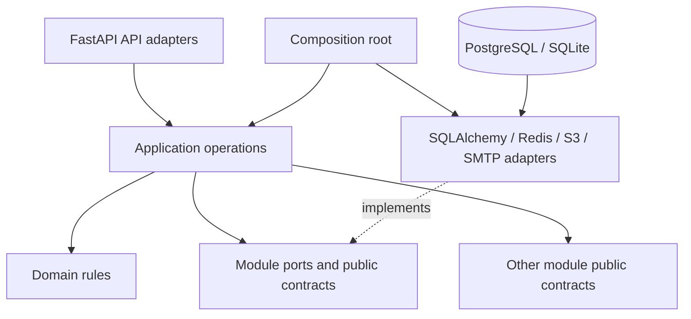

# LUG 2026 backend architecture

## Overview

Система — modular monolith: один deployable FastAPI процесс и одна транзакционная
database, но несколько вертикальных business modules с явными публичными
границами. Внутренние модули не общаются по HTTP и не требуют distributed
transactions. При необходимости конкретный module можно вынести в сервис,
сохранив его public contracts и persistence port.



Dependency direction is a rule, not a naming convention:

```text
HTTP API -> application -> domain and ports
infrastructure -> ports
module A -> module B contracts/public API
composition root -> concrete infrastructure
```

`domain` does not import FastAPI, SQLAlchemy, Redis, boto3, environment variables
or HTTP exceptions. `api` does not query ORM rows. ORM rows are converted to
explicit projections before they cross the HTTP boundary.

## Module map

| Module | Owns | Public boundary |
| --- | --- | --- |
| `auth` | login, sessions, password reset, hashing compatibility | `contracts.py`, `ports.py` |
| `users` | profile allowlist, identity review | `contracts.py`, `ports.py` |
| `teams` | registration, invites, captain policy, admission/quota | `contracts.py`, `ports.py` |
| `media` | upload lifecycle, claims, ownership and scan policy | `contracts.py`, `ports.py` |
| `portfolio` | achievements and scoring | `contracts.py`, `ports.py` |
| `video` | team video submission and review scores | `contracts.py`, `ports.py` |
| `notifications` | audience visibility, reads, broadcast creation | `contracts.py`, `ports.py` |
| `content` | settings and published results | `contracts.py`, `ports.py` |
| `admin` | organizer HTTP façade, snapshots and orchestration | `ports.py`; writes delegate to domain services |

Admin is deliberately not a second implementation of team, identity, portfolio
or video business rules. Admin application methods delegate mutations to the
owning module services; its repository is read-oriented for overview,
collections, audit and broadcast recipient queries.

## Composition and transactions

`app/main.py` is the composition root. It creates settings, async engine,
session factory, rate limiter, storage/email adapters, repositories and module
services. FastAPI dependencies only resolve the container and current user at
the edge.

Each application operation opens one `UnitOfWork`. Repositories flush but do not
commit. Commit/rollback is owned by the operation boundary. Verification emails
are sent after the registration transaction commits; a failed delivery leaves a
safe pending verification that can be resent. External I/O is moved off the
event loop through `asyncio.to_thread` adapters.

## Infrastructure adapters and local Compose

The application has explicit adapters for the dependencies that are commonly
run outside the API process:

- `S3Storage` uses boto3 and supports AWS S3 as well as MinIO through an
  endpoint URL and path-style addressing;
- `ClamAVScanner` speaks the networked `clamd` `PING`/`INSTREAM` protocol, while
  `CommandScanner` remains available for a host-installed scanner;
- `EmailService` supports SMTP and probes the configured server during
  readiness; `log` remains the deterministic development fallback.

`docker-compose.yml` runs PostgreSQL, Redis, MinIO, a bucket initializer,
ClamAV and Mailpit. This is a real local integration environment, not a set of
unused environment-variable examples. Managed production equivalents can be
substituted without changing module/application code because the composition
root selects the adapters from typed settings.

## Persistence

The relational schema owns identity, relationships, status and authorization
fields as columns with foreign keys, unique constraints and indexes. JSON is
limited to extensible settings and video criteria. `teams.captain_id` is
intentionally not an FK because creation of a team and its first user is one
transaction with a circular insert dependency; `users.team_id` remains an FK.

`alembic/versions/0001_initial_schema.py` uses explicit `op.create_table` and
`op.create_index` calls, so `alembic upgrade head --sql` is usable and the API
does not create schema at startup. See [`docs/migration.md`](docs/migration.md)
for the legacy JSON migration strategy.

## Authentication and authorization

- sessions are opaque random tokens; only SHA-256 token hashes are persisted;
- cookies are HttpOnly, SameSite=Lax and Secure in staging/production;
- state-changing requests require `X-CSRF-Token` matching `lug_csrf`;
- password hashing defaults to Argon2id; legacy scrypt hashes are verified once
  and rehashed after successful login;
- anonymous, participant, captain, reviewer/admin, and object ownership checks
  are enforced at dependencies and application policies;
- uploads, achievements, team video and notifications apply object-level checks;
- production rejects weak/default admin and verification secrets.

The current repository has two roles (`participant`, `admin`). “Captain” and
“reviewer” are capabilities derived from team ownership/admin review policy,
not additional persisted roles.

## HTTP contracts and errors

Every JSON endpoint declares Pydantic request/response models. The internal
error hierarchy is HTTP-independent (`ValidationAppError`, `AuthenticationError`,
`AuthorizationError`, `NotFoundError`, `ConflictError`, `RateLimitError`). The
HTTP adapter maps it to the frontend-compatible envelope:

```json
{"error": "human-readable message", "code": "STABLE_CODE", "details": {}}
```

OpenAPI adds cookie, CSRF and operations bearer schemes and common error
responses. `/api/openapi.json` is retained as a generated compatibility alias;
the checked-in weak legacy schema is not used at runtime.

## Observability and operations

JSON logs redact emails, tokens and secrets. Each request gets a bounded request
ID and trace ID; metrics expose bounded method/path/status labels. `/health` is
process liveness and `/ready` checks critical dependencies. Operations endpoints
are loopback-accessible only in development and require `LUG_OPERATIONS_TOKEN`
in hardened environments.

## Testing strategy

The suite covers:

- API smoke and OpenAPI generation;
- registration, session, dashboard, uploads, portfolio, admin review and
  notification flows;
- anonymous/participant/admin authorization, mass-assignment and object policy;
- static module-boundary checks;
- clean Alembic upgrade/downgrade/upgrade;
- legacy route aliases and error serialization.

Unit/API tests keep SQLite, local storage, log email and the in-memory limiter
for deterministic feedback. Adapter tests cover the ClamAV wire protocol, and
Compose smoke verification validates the concrete MinIO/ClamAV/Mailpit wiring.
The same adapter contracts can point at managed PostgreSQL, S3, scanner and
SMTP in staging/production.

## Intentional behavior changes

1. Private files whose scan status is not `clean` are denied even if a legacy
   metadata record exists; this closes an unsafe pending/rejected read path.
2. Chat notifications remain absent because the reference frontend and smoke
   contract explicitly reject `kind=chat`.
3. `/docs`, `/redoc`, `/openapi.json`, `/health` and `/ready` are added while all
   observed legacy routes remain available.
